<div align="center">



[](https://python.org)
[](https://core.telegram.org)
[](https://openai.com)
[](https://make.com)
[](#)

</div>

# Bot Antishock Estoque

## Requisitos
1. Instale Python 3.11 (ou 3.10/3.12). Use a versão estável mais recente, preferencialmente 3.11.
2. Marque a opção **Add Python to PATH** no instalador.

## Passos para rodar (Windows)
1. Abra o terminal no diretório do projeto:
   ```powershell
   cd "c:\Users\Orcamento3\Desktop\botantishock"
   ```
2. Atualize o token e a chave OpenAI no arquivo `run_bot.bat`.
3. Execute:
   ```powershell
   run_bot.bat
   ```

## Estrutura
- `parser_bot.py`: parser de intenção para texto/placa/OS.
- `bot_telegram.py`: bot Telegram que responde com JSON e suporta áudio com transcrição.
- `run_bot.bat`: script para iniciar direto.
- `requirements.txt`: dependências.

## Uso rápido
- Envie texto: `onde está a lanterna renegade GGL8443`
- Envie foto com legenda: `voltou ao estoque moldura renegade GGL8443`
- Envie áudio (voz): tenta transcrever com OpenAI.

## Observação
- Se não tem OpenAI key no ambiente, envie JSON no chat com campo `openai_api_key` antes do texto.

## 👨‍💻 Contato

[](https://www.linkedin.com/in/automatizadu/)
[](mailto:eduardosilvapsn1@gmail.com)